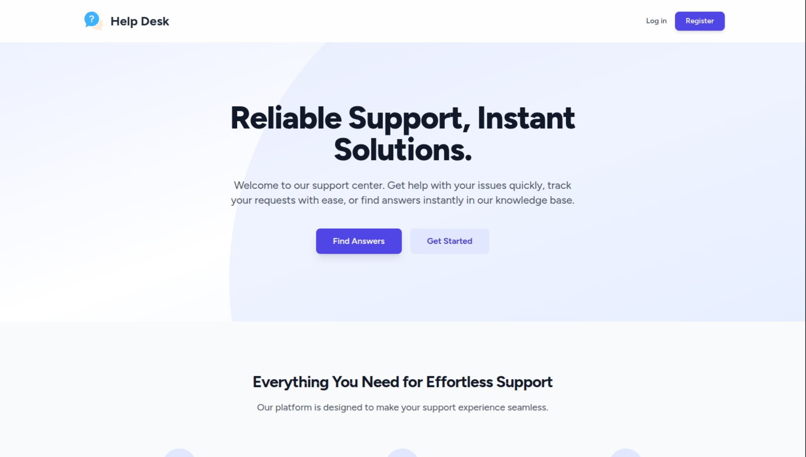

# Help Desk Ticket Management System


A modern, full-featured Help Desk Ticketing System built with Laravel. This application provides a seamless experience for clients, agents, and administrators, incorporating AI-powered features for enhanced support and automation.



---

## ✨ Key Features

### For Clients
- **Secure Authentication:** Easy and secure login and registration.
- **Creative Landing Page:** A welcoming entry point with a searchable Knowledge Base.
- **Effortless Ticket Submission:** A clean form to submit tickets with a title, description, category, and file attachments.
- **Personal Dashboard:** View personal ticket history with dynamic status tracking.
- **Ticket Interaction:** Add replies to ongoing tickets.
- **Reopen Tickets:** Ability to reopen recently resolved or closed tickets with a comment.
- **Close Tickets:** Manually close a ticket after receiving a resolution confirmation email.
- **AI Support Chat:** An integrated chatbot powered by Google's Gemini AI to answer questions and provide assistance.

### For Agents
- **Dedicated Dashboard:** A view of all tickets currently assigned to the logged-in agent.
- **Status Management:** Update ticket status between `In Progress`, `Pending`, and `Resolved`, with workflow rules enforced.
- **Internal & Public Replies:** Communicate with clients or leave private notes for other staff.
- **Notifications:** Receive email and in-app notifications when a ticket is assigned or reopened.

### For Administrators
- **Comprehensive Admin Panel:** Full control over the entire system.
- **Statistics Dashboard:** At-a-glance metrics and charts (Tickets by Status, Tickets by Category) powered by Chart.js.
- **Full Ticket Oversight:** View and filter all tickets in the system by status, category, priority, agent, date, or search query.
- **Manual Ticket Assignment:** Manually assign or reassign any ticket to any agent.
- **AI-Powered Assignment:**
    - **Automatic Assignment:** New tickets are automatically assigned to the most suitable agent by a Gemini AI-powered background job.
    - **Manual Trigger:** Manually trigger the AI to re-evaluate and assign a ticket from the ticket detail view.
- **Full User Management (CRUD):** Create, view, edit, and delete users (Clients, Agents, Admins).
- **Agent Specialization:** Assign specializations to agents to improve AI assignment accuracy.
- **FAQ Management (CRUD):** Manage the public Knowledge Base that is used by clients and the AI Chatbot.
- **PDF Export:** Download a clean, formatted PDF of any ticket and its full conversation history.

---

## 💻 Technology Stack

- **Backend:** Laravel 10, PHP 8.1+
- **Frontend:** Laravel Blade, Tailwind CSS, Alpine.js
- **Database:** MySQL
- **AI Features:** Google Gemini API (`gemini-1.5-flash-latest`)
- **Notifications:** Laravel Notifications (Email & Database)
- **Queues:** Laravel Queues for background jobs (AI Assignment)
- **PDF Generation:** `barryvdh/laravel-dompdf`
- **Charting:** Chart.js

---

## 🚀 Installation & Setup

Follow these steps to get the application running on your local machine.

### 1. Clone the Repository
```bash
git clone https://github.com/IlyCodes/Helpdesk---Ticket-Management-System.git
cd Helpdesk---Ticket-Management-System
```
### 2. Install Dependencies
```bash
composer install
npm install
```
### 3. Environment ConfigurationCopy the example environment file:
```bash
cp .env.example .env
```
Generate a new application key:
```bash
php artisan key:generate
```
Configure your .env file with your database credentials and other necessary settings:
```bash
DB_CONNECTION=mysql
DB_HOST=127.0.0.1
DB_PORT=3306
DB_DATABASE=your_database
DB_USERNAME=root
DB_PASSWORD=
```
# Add your Gemini API Key
```bash
GEMINI_API_KEY=your_actual_gemini_api_key_here
```
# Configure Mail Settings (e.g., for Mailtrap or another service)
```bash
MAIL_MAILER=smtp
MAIL_HOST=smtp.mailtrap.io
MAIL_PORT=2525
MAIL_USERNAME=your_mailtrap_username
MAIL_PASSWORD=your_mailtrap_password
MAIL_FROM_ADDRESS="hello@example.com"
MAIL_FROM_NAME="${APP_NAME}"
```
### 4. Database Migration & Seeding
Run the database migrations to create all the tables, and then run the seeders to populate the database with initial data (statuses, categories, FAQs).
```bash
php artisan migrate --seed
```
### 5. Link Storage
Create a symbolic link to make uploaded files (like ticket attachments) publicly accessible.
```bash
php artisan storage:link
```
### 6. Run the Queue Worker
The AI ticket assignment runs as a background job. Start a queue worker to process these jobs.
```bash
php artisan queue:work
```
### 7. Compile Assets & Serve
In a separate terminal, compile your frontend assets and start the development server.
```bash
npm run dev
```
In another terminal, serve the application:
```bash
php artisan serve
```
You can now access the application at http://localhost:8000.
